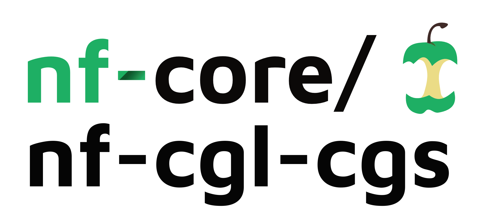

<h1>
  <picture>
    <source media="(prefers-color-scheme: dark)" srcset="docs/images/nf-core-nf-cgl-cgs_logo_dark.png">
    
  </picture>
</h1>

[](https://github.com/Clinical-Genomics-Laboratory/nf-cgl-cgs/actions/workflows/ci.yml)
[](https://github.com/Clinical-Genomics-Laboratory/nf-cgl-cgs/actions/workflows/linting.yml)

[](https://www.nextflow.io/)
[](https://www.docker.com/)
[](https://sylabs.io/docs/)

## Introduction

**Clinical-Genomics-Laboratory/nf-cgl-cgs** is a bioinformatics pipeline that leverages the [Illumina DRAGEN Bio-IT Platform](https://support.illumina.com/sequencing/sequencing_software/dragen-bio-it-platform.html) to conduct sample alignment and joint genotyping for consitutional genomes.

## Pipeline summary

This pipeline can demultiplex samples if requested or start from a `fastq_list.csv` file generated from already demultiplexed data.

This this pipeline will perform the following:

1. Alignment for each sample
2. Joint genotyping on all samples
   - By default, joint genotyping of small variants is turned on
   - Optionally, copy number variants (CNV) and structural variants (SV) can be joint genotyped
3. Each sample is split from the joint genotyped VCF file

## Usage

> [!NOTE]
> If you are new to Nextflow and nf-core, please refer to [this page](https://nf-co.re/docs/usage/installation) on how
> to set-up Nextflow. Make sure to [test your setup](https://nf-co.re/docs/usage/introduction#how-to-run-a-pipeline)
> with `-profile test` before running the workflow on actual data.

### Start from Illumina run directory

```bash
nextflow run \
  Clinical-Genomics-Laboratory/nf-cgl-cgs \
  -r v1.0.0 \
  -profile <docker/singularity/institute> \
  --input samplesheet.xlsx \
  --illumina_rundir <RUNDIR> \
  --batch_name 20240717_cGS \
  --sample_info daily_accession_log.csv \
  --demux_outdir <DEMUX OUTDIR> \
  --outdir <OUTDIR>
```

### Start from `fastq_list.csv`

```bash
nextflow run \
  Clinical-Genomics-Laboratory/nf-cgl-cgs \
  -r v1.0.0 \
  -profile <docker/singularity/institute> \
  --fastq_list fastq_list.csv \
  --batch_name 20240717_cGS \
  --sample_info daily_accession_log.csv \
  --outdir <OUTDIR>
```

> [!WARNING]
> Please provide pipeline parameters via the CLI or Nextflow `-params-file` option. Custom config files including those
> provided by the `-c` Nextflow option can be used to provide any configuration _**except for parameters**_;
> see [docs](https://nf-co.re/usage/configuration#custom-configuration-files).

For more details and further functionality, please refer to the [usage documentation](docs/usage) and the [parameter documentation](docs/parameters).

## Pipeline output

For more details about the output files and reports, please refer to the
[output documentation](docs/output).

## Contributions and Support

If you would like to contribute to this pipeline, please see the [contributing guidelines](.github/CONTRIBUTING.md).

## Citations

An extensive list of references for the tools used by the pipeline can be found in the [`CITATIONS.md`](CITATIONS.md) file.

You can cite the `nf-core` publication as follows:

> **The nf-core framework for community-curated bioinformatics pipelines.**
>
> Philip Ewels, Alexander Peltzer, Sven Fillinger, Harshil Patel, Johannes Alneberg, Andreas Wilm, Maxime Ulysse Garcia, Paolo Di Tommaso & Sven Nahnsen.
>
> _Nat Biotechnol._ 2020 Feb 13. doi: [10.1038/s41587-020-0439-x](https://dx.doi.org/10.1038/s41587-020-0439-x).
