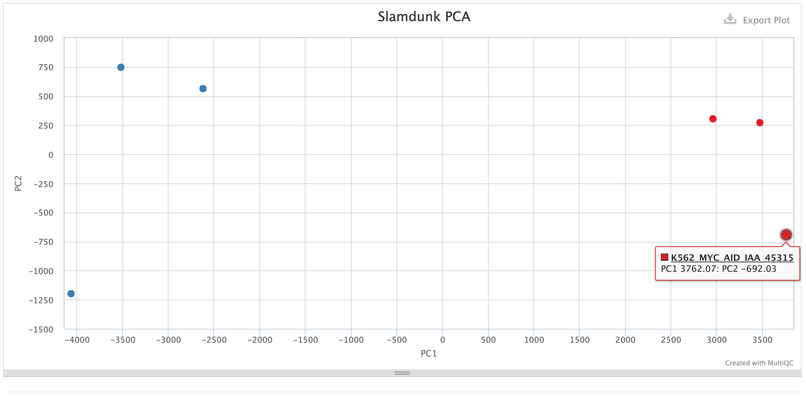
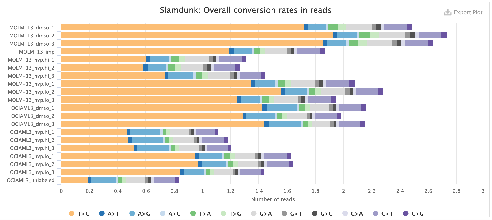
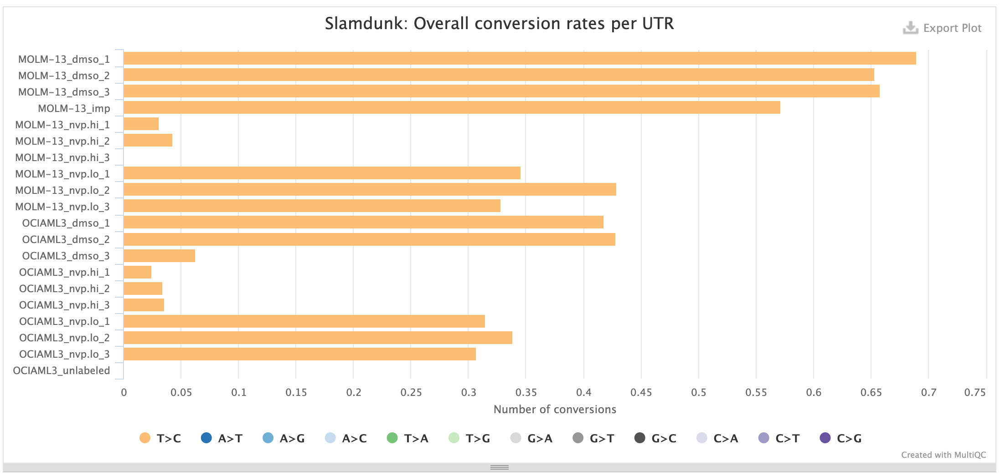
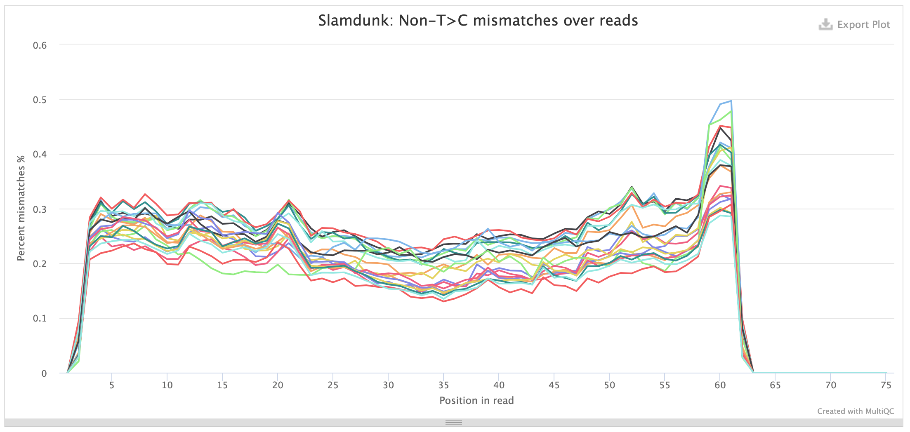
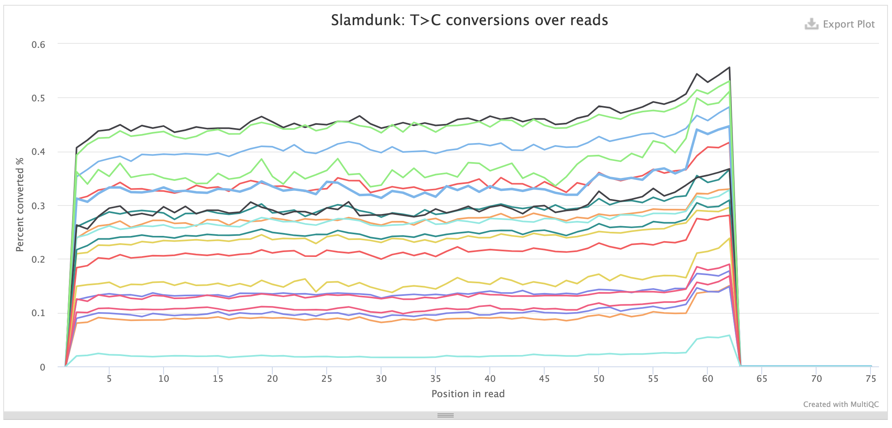
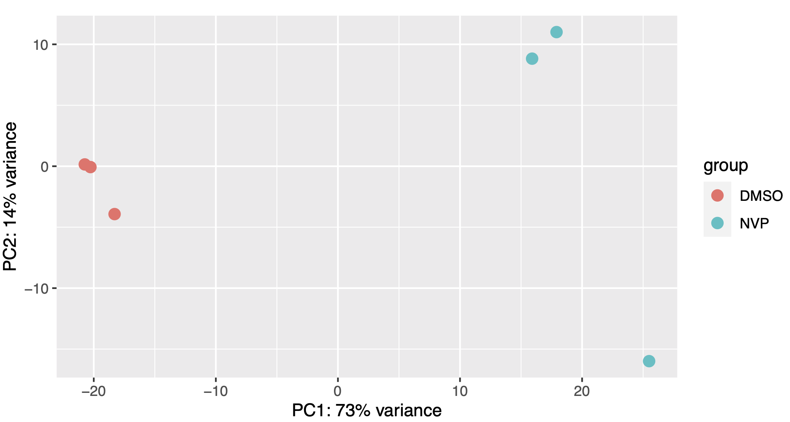
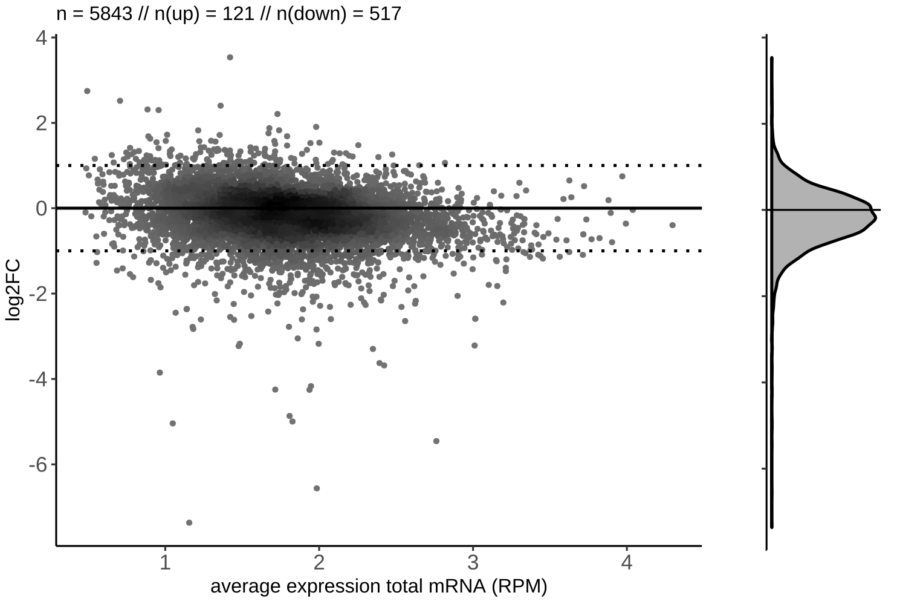
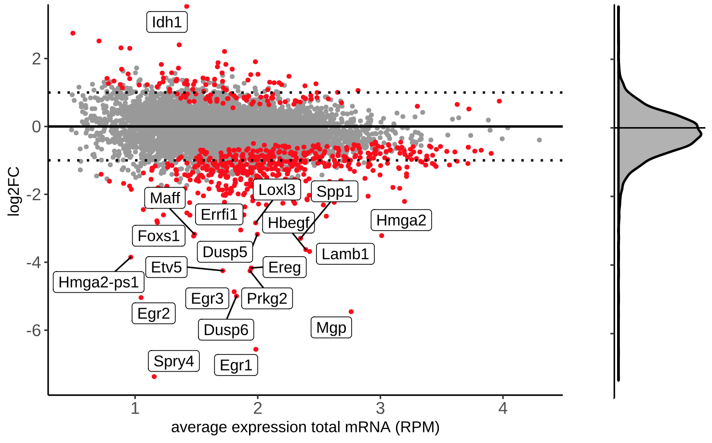

# nf-core/slamseq: Output

This document describes the output produced by the pipeline. Most of the plots are taken from the MultiQC report, which summarises results at the end of the pipeline.

## Pipeline overview

The pipeline is built using [Nextflow](https://www.nextflow.io/)
and processes data using the following steps:

1. Adapter trimming ([`Trim Galore!`](https://www.bioinformatics.babraham.ac.uk/projects/trim_galore/))
2. Conversion-aware mapping ([`Slamdunk`](http://t-neumann.github.io/slamdunk/))
3. Alignment filtering and multimapper recovery ([`Slamdunk`](http://t-neumann.github.io/slamdunk/))
4. SNP calling to filter T>C SNPs ([`Slamdunk`](http://t-neumann.github.io/slamdunk/))
5. Total and converted read quantification ([`Slamdunk`](http://t-neumann.github.io/slamdunk/))
6. Collapsing quantifications on gene level ([`Slamdunk`](http://t-neumann.github.io/slamdunk/))
7. Calculating QC stats ([`Slamdunk`](http://t-neumann.github.io/slamdunk/))
    1. Summary-statistics for nucleotide-conversions on a read level
    2. Summary-statistics for nucleotide-conversions on a gene level
    3. Summary-statistics for nucleotide-conversions along read positions
    4. Summary-statistics for nucleotide-conversions along gene positions
8. Summarising Slamdunk results ([`Slamdunk`](http://t-neumann.github.io/slamdunk/))
    1. Sequenced reads
    2. Mapped reads
    3. Retained reads
    4. Counted reads
9. Determine direct transcriptional targets ([`DESeq2`](https://doi.org/10.1186/s13059-014-0550-8))
10. Present QC for raw read, trimming, alignment, filtering and quantification ([`MultiQC`](http://multiqc.info/), [`R`](https://www.r-project.org/))

## TrimGalore

The nfcore/slamseq pipeline uses [TrimGalore](http://www.bioinformatics.babraham.ac.uk/projects/trim_galore/) for removal of adapter contamination and trimming of low quality regions. TrimGalore uses [Cutadapt](https://github.com/marcelm/cutadapt) for adapter trimming and runs FastQC after it finishes.

MultiQC reports the percentage of bases removed by TrimGalore in the _General Statistics_ table, along with a line plot showing where reads were trimmed.

## Slamdunk

[Slamdunk](https://github.com/t-neumann/slamdunk) is a software to map and quantify nucleotide-conversion containing read sets with ultra-high sensitivity. The nfcore/slamseq pipeline uses Slamdunk for mapping SLAMseq datasets, calculating QC metrics and extracting both total and converted read counts for differential transcriptional output analysis.

It produces several QC plots summarised in a MultiQC report, the most important ones being briefly described here:

*PCA*:

This PCA plot is calculated on the T>C converted reads from newly synthesized transcripts. They should best capture immediate changes within our samples, even when there can be no steady-state changes detected.

As with every PCA plot, your replicates should cluster together and your conditions apart.

*Rates*:

This plot shows the individual base substitutions in your reads across the entire read set. For SLAMseq datasets you should see an excess of T>C conversions with increasing labelling times. The plot below shows samples with mock treatment (DMSO) and transcriptional inhibition with a CDK9-inhibitor (NVP) where transcription is blocked which is reflected in the loss of the T>C conversion excess.

*UTR rates*:

This plot shows the median base substitutions in the annotated UTRs across the entire read set. For SLAMseq datasets you should only observe median T>C conversions > 0, the remaining substitutions should remain in background. The plot below shows the UTR rates for the same samples as above: samples with mock treatment (DMSO) and transcriptional inhibition with a CDK9-inhibitor (NVP) where transcription is blocked which is reflected in the loss of the T>C conversion excess.

*Conversions per read position*:

This plot shows the individual base substitutions across read positions across the entire read set. For SLAMseq datasets the background conversion levels should be consistent across all base conversions and read positions, for T>C conversions they should be stratified by labelling time. The plots below first show the background conversions and then as contrast the T>C conversions for th same samples as above: samples with mock treatment (DMSO) and transcriptional inhibition with a CDK9-inhibitor (NVP) where transcription is blocked which is reflected in the loss of the T>C conversion excess.

The same plots also exist for UTR positions.

**Output directory: `results/slamdunk`**

* `bam/*.{bam,bai}`
  * The aligned and filtered BAM and BAI files
* `vcf/*.vcf`
  * The called SNPs for filtering T>C SNPs from `slamdunk snp`
* `count/utrs/*tsv`
  * The total and converted read quantifications on a UTR level ([format details](https://t-neumann.github.io/slamdunk/docs.html#tcount-file-format)).
* `count/genes/*csv`
  * The total and converted read quantifications summarised per gene.

## DESeq2

[DESeq2](https://doi.org/10.1186/s13059-014-0550-8) is used to call differential transcriptional output between conditions to infer direct transcriptional targets. The nfcore/slamseq pipeline uses the total read counts to calculate the sizeFactors and then proceeds with the converted read counts for the remaining steps of the DESeq2 workflow.

DESeq2 produces several plots, the most important ones being briefly described here:

*PCA*:

This PCA plot is basically the function `plotPCA` run on the total-read normalized T>C read counts.

As with every PCA plot, your replicates should cluster together and your conditions apart.

*MA plot*:

We produce several versions of MA plots for each contrast, the most important being a density plot for the log2-fold change distribution along the baseline expression levels in the control samples, as well as MA plots where the significant hits (specifiable by the `--pvalue` parameter) are highlighted and the top 20 gene names are listed. Find below a representative example of a density and highlighted MA-plot:

**Output directory: `results/deseq2`**

* Directly in the output directory you will find one subfolder per `group`.

**Output directory: `results/deseq2/<group>`**

* `PCA.pdf`
  * A plain PCA plot for the samples in a given group (see [vignette](https://bioconductor.org/packages/release/bioc/vignettes/DESeq2/inst/doc/DESeq2.html))
* Again in each `group` folder you will find one subfolder for a given contrast of a `condition` vs the specified control condition

**Output directory: `results/deseq2/<group>/<condition>`**

* `DESeq2.txt`
  * A tab-delimited text file with the DESeq2 results containing the following columns:
    * `gene_name`: Name of the gene as in `--bed` file
    * `log2FC_deseq2`: The log2 fold-change of `condition` vs `control`
    * `padj`: Adjusted p-value for a given gene
    * `avg.RPM.ctrl`: Average RPM of the control samples for a given gene
* `MAPlot.pdf`
  * [MA-plot](https://en.wikipedia.org/wiki/MA_plot) of the average RPM in control samples vs log2 fold-changes coloring significant genes exceed the p-value threshold defined in `--pvalue`.

## MultiQC

[MultiQC](http://multiqc.info) is a visualisation tool that generates a single HTML report summarising all samples in your project. Most of the pipeline QC results are visualised in the report and further statistics are available in within the report data directory.

The pipeline has special steps which allow the software versions used to be reported in the MultiQC output for future traceability.

**Output directory: `results/multiqc`**

* `Project_multiqc_report.html`
  * MultiQC report - a standalone HTML file that can be viewed in your web browser
* `Project_multiqc_data/`
  * Directory containing parsed statistics from the different tools used in the pipeline

For more information about how to use MultiQC reports, see [http://multiqc.info](http://multiqc.info)

## Pipeline information

[Nextflow](https://www.nextflow.io/docs/latest/tracing.html) provides excellent functionality for generating various reports relevant to the running and execution of the pipeline. This will allow you to troubleshoot errors with the running of the pipeline, and also provide you with other information such as launch commands, run times and resource usage.

**Output files:**

* `pipeline_info/`
  * Reports generated by Nextflow: `execution_report.html`, `execution_timeline.html`, `execution_trace.txt` and `pipeline_dag.dot`/`pipeline_dag.svg`.
  * Reports generated by the pipeline: `pipeline_report.html`, `pipeline_report.txt` and `software_versions.csv`.
  * Documentation for interpretation of results in HTML format: `results_description.html`.
